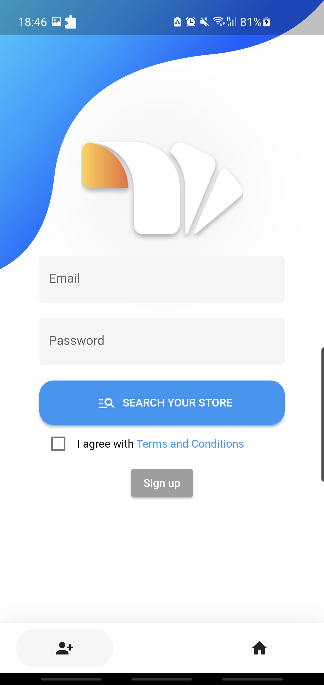
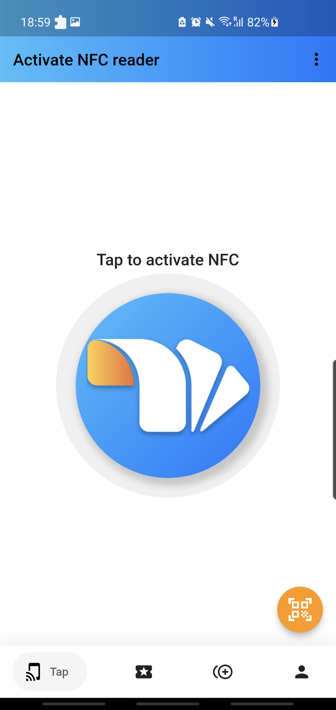
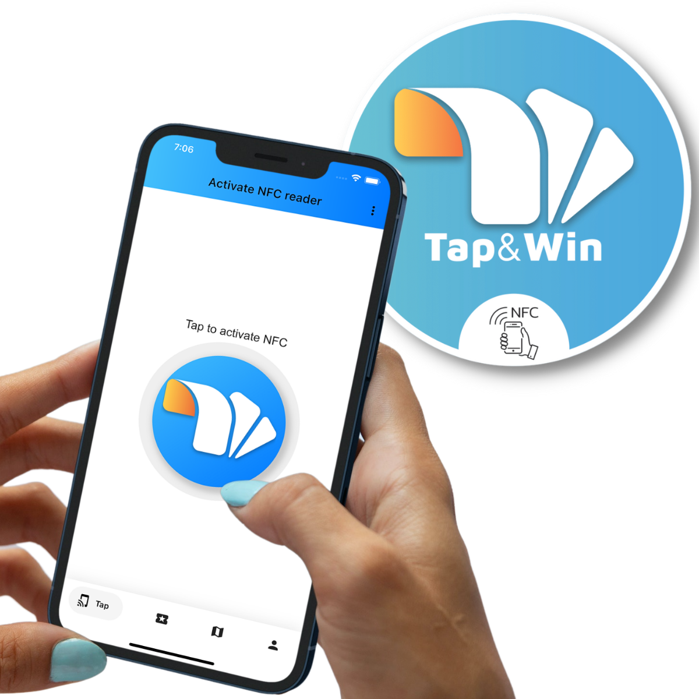
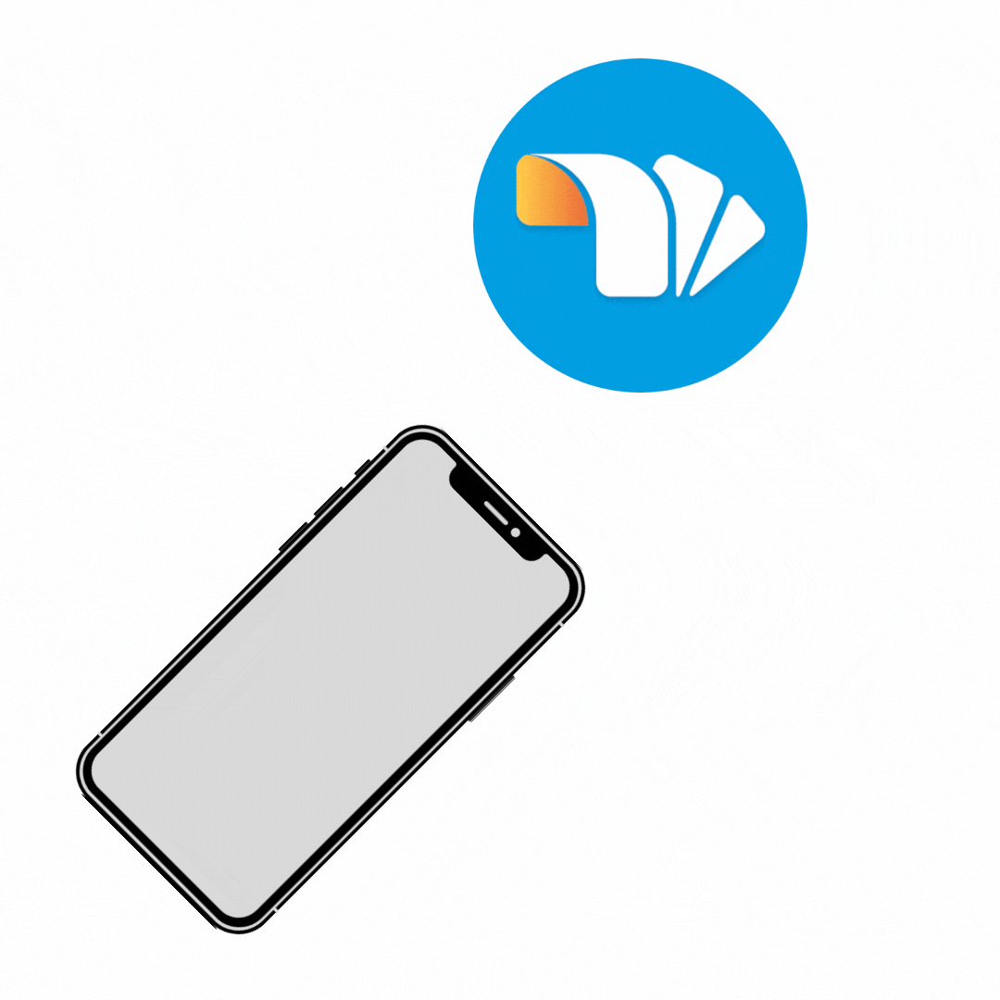

# Tap & Win Business

    

    
    
## Overview

Tap & Win is an App project aimed at digitizing and connecting offline businesses. The concept revolves around using digital coupons for marketing and cross-promotion among local businesses. Though the project is currently in a draft version and discontinued, the repository is made available to inspire and guide others who are interested.

## Screenshots

    
    

## Features

- **Digital Coupons:** Users can discover and redeem digital coupons from various local businesses, promoting a seamless transition from offline to online marketing.

- **Cross-Promotion:** Local businesses can collaborate and cross-promote through the app, enhancing the visibility of each other to a wider audience.

- **User-Friendly Interface:** The user interface is designed to be intuitive and easy to navigate.

    
    

## Project Status

The current version of Tap & Win is a draft and has been discontinued. While it may not be a fully functional app, the repository is shared to inspire and provide insights for those interested in developing similar projects.

## License

This project is licensed under the [MIT License](LICENSE.md).

## Acknowledgements

Project created in collaboration with [@tedescolor](https://www.github.com/tedescolor) and [@edoardoted99](https://www.github.com/edoardoted99).
